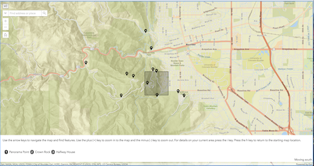

# a11y-map
A prototype app to test adding keyboard interaction (similar to Google's a11y behavior)with Esri's ArcGIS API for JavaScript version 4. 

[View it live](https://esri.github.io/a11y-map/)

## Features
To see the a11y features tab into the map and you'll see that a **megaphone icon** is visible. Once you activate this icon you'll see an extent graphic and feature list are added to the map to allow users to navigate the map content via the keyboard. 
* Use the arrow keys to move around the map
* Use the +/- keys to zoom in and out of the map
* To learn more about one of the features wihin the selection box press the associated number key. 
* To learn more about the direction the box is moving and current location press the i button

## Default Map Navigation 
This application uses version 4.x of the ArcGIS API for JavaScript which supports the following keyboard navigation for 2D maps. 

| Action      | MapView behavior                                |
|-------------|-------------------------------------------------|
| Arrow Keys  | Nudge the map to the left, right, up or down    |
| N           | Adjust the map to point North                   |
| A           | Rotate the map counterclockwise                 |
| D           | Rotate the map clockwise                        |
| +           | Incrementally zoom in at the center of the map  |
| -           | Incrementally zoom out at the center of the map |

The following keyboard navigation is supported for 3D maps

| Action     | 3d Map behavior                                                         |
|------------|-------------------------------------------------------------------------|
| Arrow keys | Nudge the map to the left, right, up or down                            |
| P          | Move the camera to look perpindicular to the data displayed in the map. |
| N          | Adjust the map to point North                                           |
| J          | Move down                                                               |
| U          | Move up                                                                 |

At this point this is just a prototype app and feedback and comments are greatly appreciated. 

You can access a live version of the app for testing here. The live test app supports a web map url parameter so you can append ?webmap=<some web map id> to the url to test with various web maps. The app requires that the map has a feature layer as the first layer and it uses the first string field it finds as the display field. 

Another interesting app that shows navigating content in an accessible manner is Patrick Arlt's demo app available here. 
[Accessible Search](https://github.com/patrickarlt/accessible-js-api-app)

## Instructions

To see the a11y features tab into the map and you'll see that a **megaphone icon** is visible. Once you activate this icon you'll see an extent graphic and feature list are added to the map to allow users to navigate the map content via the keyboard.
Once in the map you can use the arrow keys to move right, left, up or down in the map. Use - to zoom in and + to zoom out. While the location dialog is active press i for more details about the area. Under the hood pressing i does a reverse geocode to find the address for the center of the query box. 
Alternatively you can use the Search box to search for a location and then navigate the map via the drawn box on the map.

## Requirements

* Your favorite IDE
* Web browser with access to the Internet

## Resources

* [ArcGIS for JavaScript API Resource Center](http://help.arcgis.com/en/webapi/javascript/arcgis/index.html)

## Issues

Find a bug or want to request a new feature?  Please let us know by submitting an issue.

## Contributing

Esri welcomes contributions from anyone and everyone. Please see our [guidelines for contributing](https://github.com/esri/contributing).

## Licensing
Copyright 2018 Esri

Licensed under the Apache License, Version 2.0 (the "License");
you may not use this file except in compliance with the License.
You may obtain a copy of the License at

   http://www.apache.org/licenses/LICENSE-2.0

Unless required by applicable law or agreed to in writing, software
distributed under the License is distributed on an "AS IS" BASIS,
WITHOUT WARRANTIES OR CONDITIONS OF ANY KIND, either express or implied.
See the License for the specific language governing permissions and
limitations under the License.

A copy of the license is available in the repository's [license.txt](LICENSE) file.
